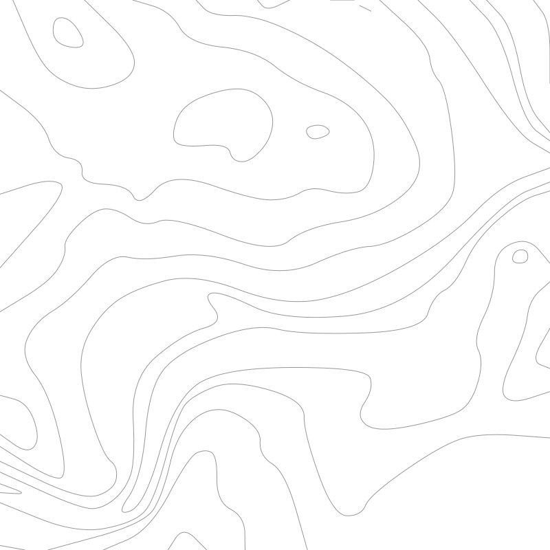
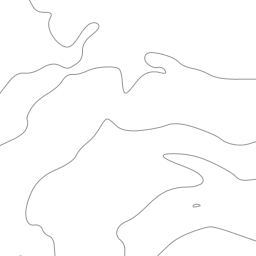
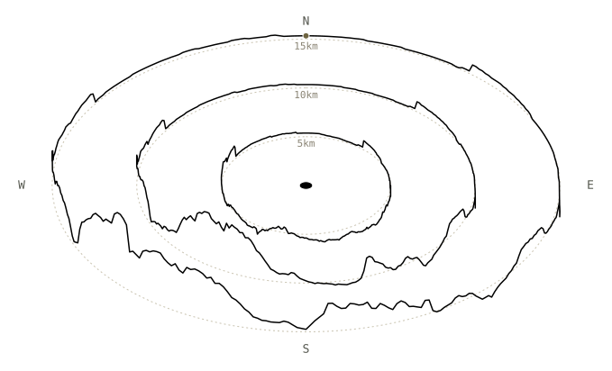

# reliefd

A Node.js/Express service for querying and visualising NASA SRTM terrain elevation data — slippy-map elevation tiles, bounding-box terrain images and raw elevation grids, contour maps (as SVG or tiles), and line-of-sight viewshed/visibility analysis — plus two p5.js demo viewers: an isometric 3-D bar chart and a pannable contour map.


*The Tyne estuary, Newcastle to Tynemouth — rendered by `/contours.svg`*

## Setup

### 1. Clone the repo

```bash
git clone https://github.com/davidchatting/reliefd.git
cd reliefd
```

### 2. Install dependencies

```bash
npm install
```

### 3. Add SRTM elevation data

This repo does not include or distribute any SRTM data — you need to supply your own `.hgt` tiles.

This service uses **NASA Shuttle Radar Topography Mission Global 1 arc second V003** data. A free NASA Earthdata account is required to download files.

- Dataset: https://doi.org/10.5067/MEASURES/SRTM/SRTMGL1.003

Files should follow the standard naming convention (e.g. `N51W001.hgt`) and be placed in the `data/` directory at the project root — it's included in the repo (empty) precisely so you have somewhere to drop tiles into. Only tiles covering the area(s) you want to view/query are needed — the server just skips locations it has no matching tile for (see `/info` below to check what's currently loaded). See [Data license](#data-license) below for usage/citation requirements.

### 4. Run

```bash
node script.js
```

The server runs on port 3000.

## Running as a service

A systemd unit file is included. Install it with:

```bash
sudo cp reliefd.service /etc/systemd/system/
sudo systemctl daemon-reload
sudo systemctl enable --now reliefd
```

## Endpoints

### Data info

```
GET /info
```

Returns JSON describing each loaded SRTM tile:

```json
{ "files": [
  { "name": "N37W123.hgt", "pixelDeg": 0.000833, "region": { "minLon": -123, "maxLon": -122, "minLat": 37, "maxLat": 38 } }
] }
```

Each entry in `files` is one loaded `.hgt` tile: `pixelDeg` is its native sample spacing in degrees (1/1200 for SRTM3, 1/3600 for SRTM1), and `region` is the 1°×1° bounding box (decimal degrees) it covers, parsed from its filename. Both are per-file rather than assumed uniform, since a `data/` directory could in principle mix SRTM1 and SRTM3 tiles.

### PNG

Both endpoints below render elevation the same way, over a fixed range of −500 m to 8500 m so areas/tiles stay consistent with each other. By default that's a plain single-channel greyscale byte (R=G=B) — a pleasant image to look at directly, at 8-bit precision. Pass `raw=true` for 16-bit precision instead, packed across the R and G channels (`R << 8 | G`, decode with `(v16 / 65535) * 9000 − 500`) — this is not a greyscale image in that mode, R and G individually look like arbitrary noise; it's for consumers that reconstruct exact elevation (e.g. the isometric viewer). Areas with no data are transparent in both modes. Because the encoding and range are identical between the two endpoints, a `/terrain` image and a `/tiles` mosaic of the same area are pixel-for-pixel interchangeable (in the same mode).

#### Slippy map tiles

```
GET /tiles/:z/:x/:y.png?raw=<bool>
```

Standard XYZ tiles compatible with Leaflet, OpenLayers, Mapbox GL, etc.:

```js
L.tileLayer('http://localhost:3000/tiles/{z}/{x}/{y}.png').addTo(map);
```

[`docs/tiles-example.png`](docs/tiles-example.png) — `/tiles/12/2030/1295.png`, the same Tyne
estuary as the hero image, at default settings (`raw=false`). Coastal elevation here sits near
0m, which under the fixed −500–8500m range renders very dark (pixel values 14–17 of 255) — see
`/contours.svg` below for the same spot with detail visible via line art instead of shading, or
open the linked image directly to see for yourself.

#### Bounding-box terrain image

```
GET /terrain?lon=<longitude>&lat=<latitude>&radius=<km>&resolution=<n>&raw=<bool>
```

| Parameter | Required | Default | Description |
|-----------|----------|---------|-------------|
| `lon` | yes | — | Longitude in decimal degrees |
| `lat` | yes | — | Latitude in decimal degrees |
| `radius` | yes | — | Radius in kilometres |
| `resolution` | no | full SRTM resolution | Output size (NxN), 8–2000. Omit for an exact per-pixel native-resolution image (not necessarily square); if given, bilinearly resamples to a square grid instead |
| `raw` | no | false | 16-bit R/G data encoding instead of the default greyscale — see above |

Returns a PNG centred on the given point.

[`docs/terrain-example.png`](docs/terrain-example.png) — `/terrain?lon=-1.5&lat=55.0&radius=5`,
centred on the Tyne estuary. `/terrain` has no default radius, so 5km (matching
`/contours.svg`'s own default) is used here; `resolution` and `raw` are left at default. Same
near-black result as `/tiles` above, for the same reason: coastal terrain near sea level under
the fixed range.

### SVG

Both endpoints below render contour lines the same way: marching squares over a bilinearly-interpolated, resampled elevation grid, with each contour chained into a single path and rendered as a quadratic-Bezier smoothed curve rather than raw straight segments, to avoid a blocky/faceted look. Every line is a plain 1px black stroke, regardless of elevation.

#### Contour map

```
GET /contours.svg?lon=<longitude>&lat=<latitude>&radius=<km>&resolution=<n>&interval=<m>&size=<px>
```

| Parameter | Required | Default | Description |
|-----------|----------|---------|-------------|
| `lon` | yes | — | Longitude in decimal degrees |
| `lat` | yes | — | Latitude in decimal degrees |
| `radius` | no | 5 | Radius in kilometres |
| `resolution` | no | 100 | Sampling grid size (NxN), 8–400 |
| `interval` | no | auto | Contour interval in metres; auto picks a "nice" interval for ~12 levels across the local elevation range |
| `size` | no | 800 | Output SVG width/height in pixels |

Returns an SVG image with one contour line per elevation level.


*`/contours.svg?lon=-1.5&lat=55.0` — every other parameter at default (`radius=5`, `resolution=100`, `interval=auto`, `size=800`): a smaller, plainer view of the same estuary as the hero image above, which used `radius=12` and `resolution=400` for a more detailed render.*

#### Contour slippy tiles

```
GET /contour-tiles/:z/:x/:y.svg?resolution=<n>&interval=<m>
```

| Parameter | Required | Default | Description |
|-----------|----------|---------|-------------|
| `resolution` | no | 128 | Sampling grid size per tile (NxN), 8–256 |
| `interval` | no | by zoom | Contour interval in metres. Default is keyed by zoom level only, so every tile at a given zoom uses the same levels and lines connect across tile edges — a per-tile auto interval based on local relief would pick different levels per tile and the lines wouldn't line up |

The zoom-keyed interval default mirrors real OS leisure-map intervals, anchored at the zoom level the equivalent published scale converts to (`metresPerPixel = 156543 * cos(lat) / 2^z`, equator-approximate):

| Zoom | Interval | Equivalent scale |
|------|----------|-------------------|
| ≤9 | 100m | wider than 1:1,000,000 |
| ≤11 | 50m | ~1:250,000 |
| ≤12 | 20m | ~1:100,000 |
| ≤14 | 10m | ~1:50,000 — OS Landranger interval |
| ≤16 | 5m | ~1:25,000 — OS Explorer interval (lowland) |
| ≤18 | 2m | ~1:10,000 — finer than any OS leisure map |
| >18 | 1m | survey/LIDAR-grade resolution |

OS Explorer doubles its interval to 10m in mountainous regions, but that's decided per published map sheet (a fixed boundary), not computed live — doing it per-tile from local relief would make neighbouring tiles disagree right where one straddles the steep/flat line, breaking the cross-tile stitching above. Pass `?interval=10` explicitly for mountainous areas instead of relying on auto-detection.

Standard XYZ contour tiles, black lines on a transparent background — usable as a slippy-map overlay:

```js
L.tileLayer('http://localhost:3000/contour-tiles/{z}/{x}/{y}.svg').addTo(map);
```


*`/contour-tiles/12/2030/1295.svg` — the same tile as `/tiles` above, contoured at default settings (`resolution=128`, `interval=20m`, the zoom≤12 default from the table above).*

### Bounding-box terrain data

```
GET /heightmap?lon=<longitude>&lat=<latitude>&radius=<km>&samples=<n>
```

| Parameter | Required | Default | Description |
|-----------|----------|---------|-------------|
| `lon` | yes | — | Longitude in decimal degrees |
| `lat` | yes | — | Latitude in decimal degrees |
| `radius` | no | 1 | Radius in kilometres |
| `samples` | no | 64 | Sampling grid size (NxN), 2–256 |

The raw-data counterpart to `/terrain`: instead of a rendered image, returns a JSON grid of bilinearly-interpolated elevation values in metres, row-major from the north-west corner:

```json
{ "samples": 64, "data": [53.78, 53.78, 54.36, 55.21, 55.68, 55.92, ...] }
```

Real output from `/heightmap?lon=-1.5&lat=55.0` (defaults: `radius=1`, `samples=64`) — the first row of 64×64 elevation values, in metres, starting at the estuary's north-west corner.

### Terrain profile

```
GET /line.svg?lon1=<longitude>&lat1=<latitude>&lon2=<longitude>&lat2=<latitude>&curved=<bool>&samplesPerKm=<n>&width=<px>&heightScale=<n>
```

| Parameter | Required | Default | Description |
|-----------|----------|---------|-------------|
| `lon1` / `lat1` | yes | — | Start point (drawn on the left) |
| `lon2` / `lat2` | yes | — | End point (drawn on the right) |
| `curved` | no | true | Whether to add Earth's curvature (see below) or plot a flat cross-section ignoring it |
| `samplesPerKm` | no | 10 | Elevation samples per kilometre of path, 0.01–50 — a rate rather than a flat total, so resolution doesn't depend on any one path's length (same reasoning as `/visibility`'s `stepsPerKm`). The resulting total sample count is still capped to 8–2000 |
| `width` | no | 800 | Output SVG width in pixels, 100–2000 |
| `heightScale` | no | 1 | Terrain-relief exaggeration factor, 0.001–100000 (see below) |

Returns an SVG line chart of elevation along the great-circle path from the start point to the end point, drawn true to scale by default: one metres-per-pixel factor, derived from `width` and the distance between the points, applies to the horizontal axis and to sea level's curved position — the geometric fact of where the curve puts sea level isn't something the chart distorts. Real terrain relief is drawn above that sea-level baseline at the same true scale by default too, unless `heightScale` says otherwise. There's no `height` parameter: the artboard's height and vertical `viewBox` are derived from the resulting line itself, cropped tightly around it (with a sliver of padding for the stroke width) rather than placed somewhere inside a fixed canvas. Missing data along the path (e.g. no `.hgt` tile loaded for that section) is treated as sea level rather than leaving a gap.

`heightScale` exaggerates real terrain relief only — it never touches the horizontal (distance) scale, nor sea level's curved position, only how many pixels a metre of *elevation above sea level* maps to, e.g. `heightScale=100` draws every metre of relief 100x taller than true scale while the curvature stays geometrically accurate. This is useful for making subtle terrain visible without the tiny proportions true scale would otherwise give it, and without exaggerating (and so misrepresenting) the curvature itself; since the artboard auto-crops to fit, there's no need to separately raise a canvas size to match.

When `curved` is enabled, each sample has the exact sagitta added — the height an arc rises above its chord, zero at both endpoints and maximum at the midpoint. A chord between two points on a sphere lies inside it, so the true surface between them actually rises above a straight line drawn between them by this amount (the same effect that limits radio/visual line-of-sight over distance); `curved=false` plots the raw elevations instead, ignoring Earth's shape entirely.


*`/line.svg?lon1=-1.5&lat1=54.05&lon2=-1.5&lat2=55.95&curved=true&heightScale=20` — a longer, ~211km profile (`width` left at its default 800) chosen so curvature's contribution is actually significant rather than negligible: at the midpoint, the sagitta alone puts the curved sea-level baseline ≈872m below a straight chord between the endpoints — taller than any hill the previous example found within 15km of the Tyne estuary. `curved=true` is already the default; it's spelled out here for clarity — drop it (or set `curved=false` on the same URL) and that baseline flattens back to a straight line, ignoring Earth's shape entirely. `heightScale=20` is carried over from the suggestion above, so real terrain relief still reads clearly on top of the curve rather than the whole 211km profile collapsing to a hairline.*

### Skyline profile

```
GET /skyline.svg?lon=<longitude>&lat=<latitude>&radius=<km>&directions=<n>&steps=<n>&observerHeight=<m>&targetHeight=<m>&refraction=<bool>&width=<px>&heightScale=<n>
GET /skyline.svg?lon=<longitude>&lat=<latitude>&lon2=<longitude>&lat2=<latitude>&...
```

| Parameter | Required | Default | Description |
|-----------|----------|---------|-------------|
| `lon` / `lat` | yes | — | Centre point |
| `radius` | one of `radius` / `lon2`+`lat2` | — | Search radius in kilometres, 0.5–200 |
| `lon2` / `lat2` | one of `radius` / `lon2`+`lat2` | — | A point out to which to search instead — radius becomes the distance from the centre to this point, echoing `/line.svg`'s `lon2`/`lat2` |
| `directions` | no | 360 | Number of bearings sampled around the centre, 8–720 |
| `steps` | no | 256 | Samples per bearing out to `radius`, 8–2000 |
| `observerHeight` | no | 1.7 | Height (metres) added to the centre point's ground elevation |
| `targetHeight` | no | 0 | Height (metres) added to every sampled point |
| `refraction` | no | true | Same 7/6-Earth-radius correction as `/viewshed`/`/visibility` |
| `width` | no | 800 | Output SVG width in pixels, 100–2000 |
| `heightScale` | no | 1 | Vertical exaggeration factor, 0.001–100000 (see below) |

`/line.svg`'s circular sibling: for each of `directions` bearings around the centre point, runs the same outward line-of-sight scan as `/viewshed` (`steps` samples out to `radius`, tracking the steepest angle seen so far) to find the furthest genuinely *visible* point in that direction — a closer hill correctly hides whatever's behind it — then plots that point's apparent height above eye level (curvature and refraction already folded in, the same quantity `/viewshed` uses) against bearing. The result is the actual silhouette of what you'd see standing at the centre point and turning through 360°: a real skyline, not just a cross-section of a fixed ring.

The x-axis is bearing (0–360°) rather than distance, so the plotted line's value at the left edge always exactly matches its value at the right edge — both are bearing 0 — meaning the line joins seamlessly if tiled side by side or wrapped into a loop. There's no natural horizontal distance scale here either, since the x-axis is angular rather than metric, so the vertical scale instead borrows the px-per-metre a `/line.svg` path of length `radius` would use, purely so `heightScale=1` still means true-to-life proportions.


*`/skyline.svg?lon=-1.5&lat=55.0&radius=15&heightScale=5` — the visible horizon in every direction from the estuary, out to 15km, with `heightScale` raised to 5 to make it visible at all (same true-scale flatness problem as above, otherwise).*

The same data, bent around a ring instead of unrolled into a strip, and tilted into true isometric view (30° ground-line angle) — north at the top, the line starts there (marked) and runs clockwise. This isn't a server endpoint, just `p5js/skyline.js` re-projecting `/skyline.svg`'s own rendered output, one fetch per radius; see [`p5js/README.md`](p5js/README.md#skyline-viewer) for how, and `p5js/skyline.html` for the live version (retype coordinates to re-centre; no drag-to-pan like the other two viewers). `?radii=5,10,15` (comma-separated, replacing the single `?radius=`) draws several as concentric, proportionally-scaled rings in one image instead of just one.


*`p5js/skyline.html?lon=-1.5&lat=55.0&radii=5,10,15` — three rings instead of one, each dashed ring its own eye-level baseline, each solid line the real skyline at that radius, plain black like every other line here. A small "Nkm" label sits at 12 o'clock, directly under each ring's own line, so radius alone (plus the label) is what tells them apart. The small filled ellipse at the centre marks the observer's own position, drawn as the same isometric shape as the rings rather than a screen-space circle, so it reads as sitting flat on the same ground plane. The ground genuinely falls away to the east (all three dip there, across the estuary) and rises into the hills to the south-west.*

### Line-of-sight

Both endpoints below are two views onto the same line-of-sight test, sharing one implementation (`lineOfSightAngle`/`lineOfSightAngleAtElevation`): `/viewshed` scans outward from the observer to find the visibility boundary in every direction; `/visibility` instead checks specific target points against the observer. Both return JSON.

#### Viewshed (line-of-sight horizon)

```
GET /viewshed?lon=<longitude>&lat=<latitude>&radius=<km>&directions=<n>&steps=<n>&observerHeight=<m>&targetHeight=<m>&refraction=<bool>
```

| Parameter | Required | Default | Description |
|-----------|----------|---------|-------------|
| `lon` | yes | — | Observer longitude in decimal degrees |
| `lat` | yes | — | Observer latitude in decimal degrees |
| `radius` | no | 30 | Maximum search radius in kilometres, 0.5–200 |
| `directions` | no | 360 | Number of bearings sampled around the observer, 8–720 |
| `steps` | no | 256 | Samples taken along each bearing out to `radius`, 8–2000 |
| `observerHeight` | no | 1.7 | Height (metres) added to the observer's ground elevation, e.g. eye height |
| `targetHeight` | no | 0 | Height (metres) added to every sampled target point, e.g. to ask "can I see the top of a 10m mast" |
| `refraction` | no | true | Whether to apply the standard 7/6-Earth-radius correction for atmospheric refraction (pass `false` for pure geometric line of sight) |

For each bearing, marches outward sampling elevation (bilinearly interpolated, same as the other endpoints) and tracks the point with the steepest line-of-sight angle seen so far — a point further out is only "visible" if its angle clears every closer point along that bearing, accounting for Earth's curvature. The single furthest visible point per bearing becomes one vertex of the returned shape. No-data samples (e.g. open sea beyond the loaded tiles) are treated as sea level rather than a gap, so looking out to sea still gives a sensible curvature-limited range.

Returns a GeoJSON `Feature` with a `Polygon` geometry — the boundary of furthest visibility in every direction:

```json
{ "type": "Feature",
  "properties": { "lon": -1.5, "lat": 55, "radiusKm": 30, "directions": 360, "steps": 256, "observerHeight": 1.7, "targetHeight": 0, "refraction": true },
  "geometry": { "type": "Polygon", "coordinates": [[[-1.5, 55.003162], [-1.499904, 55.003161], ..., [-1.5, 55.003162]]] } }
```

Real output from `/viewshed?lon=-1.5&lat=55.0` (all other parameters default) — an observer standing at the estuary, `coordinates` truncated here from 361 points to 3.

Note the shape can be sharply non-convex — a hillside 200m away can legitimately be the furthest visible point in one direction while an adjacent bearing looking down an open valley or coastline sees 20+ km, with no smooth transition between them.

#### Visibility (specific points)

```
GET /visibility?lon=<longitude>&lat=<latitude>&targets=<lon,lat[,altitude]|...>&observerHeight=<m>&targetHeight=<m>&refraction=<bool>&stepsPerKm=<n>
POST /visibility   { "lon", "lat", "targets": [[lon, lat], [lon, lat, altitude], ...], "observerHeight", "targetHeight", "refraction", "stepsPerKm" }
```

GET packs `targets` into the query string, which is fine for a handful of points but overflows the server's request-header limit (HTTP 431) somewhere in the low hundreds. POST takes the same data as a JSON body instead, with no such limit — use it for any non-trivial target list.

| Parameter | Required | Default | Description |
|-----------|----------|---------|-------------|
| `lon` / `lat` | yes | — | Observer position |
| `targets` | yes | — | `\|`-separated list of targets, each `lon,lat` or `lon,lat,altitude` |
| `observerHeight` | no | 1.7 | Height (metres) added to the observer's ground elevation |
| `targetHeight` | no | 0 | Height (metres) added to a target's ground elevation — only used for targets *without* an explicit altitude |
| `refraction` | no | true | Same 7/6-Earth-radius correction as `/viewshed` |
| `stepsPerKm` | no | 10 | Samples per kilometre along each observer→target path, 1–50 |

A target given as `lon,lat` is assumed to sit at ground level — whatever that happens to be at that point — plus `targetHeight`. A target given as `lon,lat,altitude` is pinned to that absolute altitude instead (e.g. a drone at a known height), ignoring both the sampled terrain and `targetHeight` for that point.

```json
{ "lon": -1.5, "lat": 55, "observerHeight": 1.7, "targetHeight": 0, "refraction": true,
  "results": [
    { "lon": -1.55, "lat": 55.05, "distanceKm": 6.408, "visible": false, "groundElevation": 46.0, "altitude": 46.0 }
  ] }
```

Real output from `/visibility?lon=-1.5&lat=55.0&targets=-1.55,55.05` (all other parameters default) — a target 6.4km away across the estuary, not visible from the observer point at ground level.

Because `/viewshed` and `/visibility` sample at different resolutions (a fixed step count over a fixed radius vs. a fixed density per path, since every target is a different distance away), they can disagree right at a visibility boundary — a point `/viewshed` reports as its furthest-visible in some direction might come back `visible: false` here at the default `stepsPerKm`, because the finer sampling along that specific path catches an intermediate obstruction the coarser radial scan stepped over. Raising `stepsPerKm` (or lowering `/viewshed`'s `steps`) narrows that gap; neither endpoint is "wrong", they're both discretized approximations of a continuous problem.

## Contour cache

`/contours.svg` and `/contour-tiles/:z/:x/:y.svg` are backed by a disk cache at `cache/` (gitignored, created on first use). Each request's parameters are hashed into a cache key; a hit is served straight off disk, a miss is computed as normal and then written to the cache before responding. Node still needs to be running to serve requests (cache misses fall through to the normal compute path, and there's no separate static-serving tier), but once an area has been requested it's cheap to re-serve, and you can pre-warm the cache for a demo area by just requesting it ahead of time (e.g. with `curl`, or by panning the slippy map yourself) so sharing the demo doesn't trigger a slow first render for the next viewer.

The cache key includes every parameter that affects the output (location/tile coordinates, resolution, interval, size), so different query strings never collide.

### Pre-warming the cache

`warm-cache.js` requests the same tile URLs `contours.html`'s slippy map would, for a range of zooms around a point, so they're already cached before you share the demo:

```bash
node warm-cache.js                                              # defaults to Anstruther, zooms 12-17, radius 2 tiles
node warm-cache.js --lat 56.2208 --lon -2.7036 --zooms 12-17 --radius 2
node warm-cache.js --base-url http://localhost:3000 --concurrency 6
```

It hits the running server over HTTP, so the server still needs to be up while warming. Once warmed, requests for that area come straight off disk regardless of who's asking.

## Data license

The SRTM dataset is freely available under the [EOSDIS Data Use Policy](https://www.earthdata.nasa.gov/engage/open-data-services-and-software/data-use-policy). Use requires the following citation:

> NASA JPL (2013). *NASA Shuttle Radar Topography Mission Global 1 arc second* [Data set]. NASA Land Processes Distributed Active Archive Center. https://doi.org/10.5067/MEASURES/SRTM/SRTMGL1.003

## License

This software is released under the [MIT License](LICENSE).
